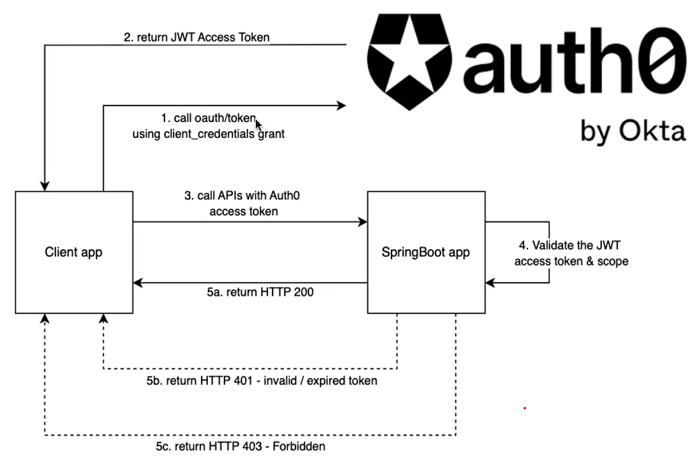

# Spring Security with client_credentials flow (M2M)

### Maven Parent overrides

Due to Maven's design, elements are inherited from the parent POM to the project POM.
While most of the inheritance is fine, it also inherits unwanted elements like `<license>` and `<developers>` from the parent.
To prevent this, the project POM contains empty overrides for these elements.
If you manually switch to a different parent and actually want the inheritance, you need to remove those overrides.

### Authentication flow with Auth0
Auth0 Flow for client-credentials (machine to machine authentication)

### WebClient Authentication Flow.
When the client app call an API ednpoint using WebClient, the following 
process will take place when the WebClient is configured properly.

    // ============================================================================
    // COMPLETE FLOW DIAGRAM
    // ============================================================================
    
    /*
    ┌─────────────────────────────────────────────────────────────────────────┐
    │                        YOUR APPLICATION CODE                             │
    │  webClient.get().uri("/api/data").retrieve().bodyToMono(String.class)  │
    └──────────────────────────┬──────────────────────────────────────────────┘
                               │
                               ▼
    ┌─────────────────────────────────────────────────────────────────────────┐
    │          ServletOAuth2AuthorizedClientExchangeFilterFunction            │
    │                      (Intercepts Request)                                │
    └──────────────────────────┬──────────────────────────────────────────────┘
                               │
                               ▼
                        ┌──────────────┐
                        │ Token Exists?│
                        └────┬───────  │
                ┌────────────┴────────────┐
                │                         │
                YES                       NO
                │                         │
                │                         ▼
                │              ┌──────────────────────┐
                │              │OAuth2AuthorizedClient│
                │              │      Manager         │
                │              └──────────┬───────────┘
                │                         │
                │                         ▼
                │              ┌──────────────────────┐
                │              │ClientCredentials     │
                │              │Provider              │
                │              └──────────┬───────────┘
                │                         │
                │                         ▼
                │              ┌──────────────────────┐
                │              │POST /oauth2/token    │
                │              │grant_type=client_creds│
                │              └──────────┬───────────┘
                │                         │
                │                         ▼
                │              ┌──────────────────────┐
                │              │Authorization Server  │
                │              │Returns Token         │
                │              └──────────┬───────────┘
                │                         │
                │                         ▼
                │              ┌──────────────────────┐
                │              │Store in Repository   │
                │              └──────────┬───────────┘
                │                         │
                └────────────┬────────────┘
                             │
                             ▼
                ┌────────────────────────┐
                │Add Authorization Header│
                │Bearer {access_token}   │
                └────────────┬───────────┘
                             │
                             ▼
                ┌────────────────────────┐
                │Forward Request to      │
                │Resource Server         │
                └────────────┬───────────┘
                             │
                             ▼
                ┌────────────────────────┐
                │Return Response         │
                └────────────────────────┘
    */

### WebClient config and how it works

  CONFIGURATION steps
- application.yml defines client registration
- WebClient configuration applies the OAuth2 filter
- OAuth2AuthorizedClientManager handles lifecycle of Token

    // ============================================================================
    // STEP-BY-STEP: How It Works
    // ============================================================================
    
    package com.example.oauth2.webclient;
    
    import org.springframework.context.annotation.Bean;
    import org.springframework.context.annotation.Configuration;
    import org.springframework.security.oauth2.client.*;
    import org.springframework.security.oauth2.client.registration.ClientRegistrationRepository;
    import org.springframework.security.oauth2.client.web.DefaultOAuth2AuthorizedClientManager;
    import org.springframework.security.oauth2.client.web.OAuth2AuthorizedClientRepository;
    import org.springframework.security.oauth2.client.web.reactive.function.client.ServletOAuth2AuthorizedClientExchangeFilterFunction;
    import org.springframework.web.reactive.function.client.WebClient;
    
    @Configuration
    public class WebClientOAuth2Config {

    // ========================================================================
    // STEP 1: Configure OAuth2AuthorizedClientManager
    // This is the brain - manages token lifecycle
    // ========================================================================
    
    @Bean
    public OAuth2AuthorizedClientManager authorizedClientManager(
            ClientRegistrationRepository clientRegistrationRepository,
            OAuth2AuthorizedClientRepository authorizedClientRepository) {

        // Create providers for different grant types
        OAuth2AuthorizedClientProvider authorizedClientProvider =
            OAuth2AuthorizedClientProviderBuilder.builder()
                .clientCredentials()  // For client_credentials grant
                .refreshToken()       // For refresh token grant
                .build();

        // DefaultOAuth2AuthorizedClientManager coordinates everything
        DefaultOAuth2AuthorizedClientManager authorizedClientManager = 
            new DefaultOAuth2AuthorizedClientManager(
                clientRegistrationRepository,   // Where client registrations are stored
                authorizedClientRepository      // Where authorized clients are stored
            );
        
        authorizedClientManager.setAuthorizedClientProvider(authorizedClientProvider);

        return authorizedClientManager;
    }

    // ========================================================================
    // STEP 2: Configure WebClient with OAuth2 Filter
    // The filter intercepts requests and adds Authorization header
    // ========================================================================
    
    @Bean
    public WebClient webClient(OAuth2AuthorizedClientManager authorizedClientManager) {
        
        // This filter is the magic - it intercepts all requests
        ServletOAuth2AuthorizedClientExchangeFilterFunction oauth2Filter = 
            new ServletOAuth2AuthorizedClientExchangeFilterFunction(authorizedClientManager);
        
        // Set default client registration ID
        // This tells the filter which client credentials to use
        oauth2Filter.setDefaultClientRegistrationId("my-client");
        
        return WebClient.builder()
            .baseUrl("http://localhost:8080")
            .apply(oauth2Filter.oauth2Configuration())  // Apply the filter
            .build();
    }
}

    // ============================================================================
    // WHAT HAPPENS BEHIND THE SCENES WHEN YOU MAKE A REQUEST
    // ============================================================================
    
    
    SCENARIO: You call webClient.get().uri("/api/data").retrieve().bodyToMono(String.class)

STEP-BY-STEP FLOW:

1. ServletOAuth2AuthorizedClientExchangeFilterFunction.filter() intercepts the request

2. It checks: "Do I already have a valid token for 'my-client'?"
    - Looks in OAuth2AuthorizedClientRepository
    - Checks if token exists and is not expired

3. IF NO VALID TOKEN:
   a. Calls OAuth2AuthorizedClientManager.authorize()
   b. Manager delegates to OAuth2AuthorizedClientProvider
   c. For client_credentials: ClientCredentialsOAuth2AuthorizedClientProvider
    - Makes POST request to token endpoint
    - Body: grant_type=client_credentials&scope=read write
    - Headers: Authorization: Basic base64(clientId:clientSecret)
      d. Authorization Server returns:
      {
      "access_token": "eyJhbGc...",
      "token_type": "Bearer",
      "expires_in": 3600,
      "scope": "read write"
      }
      e. Creates OAuth2AuthorizedClient object containing:
    - ClientRegistration (client details)
    - OAuth2AccessToken (the actual token)
    - Timestamp information
      f. Stores OAuth2AuthorizedClient in repository for future use

4. IF VALID TOKEN EXISTS:
    - Retrieves it from repository
    - Skips token acquisition

5. Adds Authorization header to your request:
   Authorization: Bearer eyJhbGc...

6. Forwards the request to the actual endpoint

7. Returns the response to you

----------

